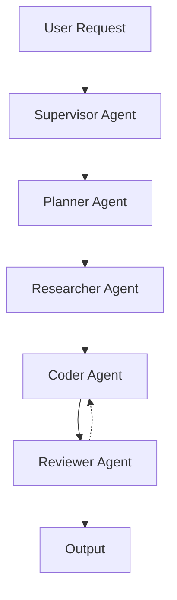

# 🚀 Construct – Your First Autonomous AI Employee

<div align="center">


[](https://frontend-theta-one-77.vercel.app)
[](LICENSE)

**Stop chatting with AI. Start managing it.**

*A premium landing page for Construct – an autonomous AI engineering platform where 5 specialized AI agents collaborate to plan, research, code, and review software autonomously.*

[Live Demo](https://frontend-theta-one-77.vercel.app) • [Construct IDE](https://construct-ide.vercel.app) • [Report Bug](https://github.com/Ramakrishna1967/Frontend/issues)

</div>

---

## 🎯 What is Construct?

Construct is an **autonomous AI coding agent** that goes beyond simple AI chat assistants. Instead of answering questions, Construct **actually builds software** through a coordinated team of 5 specialized AI agents:

| Agent | Role | What It Does |
|-------|------|--------------|
| 🧠 **Supervisor** | The Orchestrator | Coordinates all agents and manages the workflow |
| 🧭 **Planner** | The Strategist | Designs the implementation approach and architecture |
| 🔍 **Researcher** | The Context Gatherer | Searches patterns, best practices, and codebase context |
| 💻 **Coder** | The Builder | Writes production-quality code |
| 🛡️ **Reviewer** | The Quality Control | Finds bugs and suggests improvements before deployment |

---

## ✨ Features

### 🎬 Real-Time Streaming
Watch the AI think and code token-by-token via WebSockets. No waiting for complete responses.

### 🧠 Context Aware  
Deep understanding of your entire codebase via Vector Database (ChromaDB) integration. It knows your patterns.

### 🔄 Self-Correcting
The Reviewer agent actively finds and fixes bugs before deployment. Quality built in, not bolted on.

---

## 🛠️ Tech Stack

| Technology | Purpose |
|------------|---------|
| **React 18** | UI Framework |
| **TypeScript** | Type Safety |
| **Vite** | Build Tool & Dev Server |
| **Framer Motion** | Smooth Animations |
| **Lucide React** | Modern Icons |
| **CSS3** | Custom Styling (No frameworks) |

---

## 📁 Project Structure

```
construct-ui/
├── src/
│   ├── components/
│   │   ├── Hero.tsx           # Main headline & CTA
│   │   ├── AgentFlow.tsx      # 5 AI agents visualization
│   │   ├── Features.tsx       # Key feature cards
│   │   ├── Stats.tsx          # Performance metrics
│   │   ├── CTA.tsx            # Final call-to-action
│   │   ├── Footer.tsx         # Site footer
│   │   └── AnimatedShapes.tsx # 3D background animations
│   ├── App.tsx                # Main application
│   ├── main.tsx               # Entry point
│   └── index.css              # Global styles
├── public/                    # Static assets
├── index.html                 # HTML template
├── package.json               # Dependencies
├── vite.config.ts             # Vite configuration
└── tsconfig.json              # TypeScript config
```

---

## 🚀 Quick Start

### Prerequisites
- Node.js 18+ 
- npm or yarn

### Installation

```bash
# Clone the repository
git clone https://github.com/Ramakrishna1967/Frontend.git

# Navigate to project
cd Frontend

# Install dependencies
npm install

# Start development server
npm run dev
```

Visit `http://localhost:5173` to see the app.

### Build for Production

```bash
npm run build
npm run preview
```

---

## 🌐 Deployment

This project is deployed on **Vercel** with automatic deployments from the `main` branch.

| Environment | URL |
|-------------|-----|
| **Landing Page** | [frontend-theta-one-77.vercel.app](https://frontend-theta-one-77.vercel.app) |
| **Construct IDE** | [construct-ide.vercel.app](https://construct-ide.vercel.app) |

---

## 🎨 Design Highlights

- **Premium Dark Theme** – Deep space black with neon accent gradients
- **Glassmorphism** – Modern glass-effect cards with backdrop blur
- **Micro-animations** – Smooth hover effects and scroll-triggered animations
- **3D Floating Shapes** – Animated geometric shapes in the background
- **Responsive Design** – Optimized for all screen sizes

---

## 📊 Architecture Overview



The multi-agent system uses **LangGraph** for orchestration, with each agent specialized for a specific task in the software development lifecycle.

---

## 🔗 Related Repositories

| Project | Description |
|---------|-------------|
| [Construct Backend](https://github.com/Ramakrishna1967/Construct) | The AI backend with LangGraph agents |
| [Construct IDE](https://github.com/Ramakrishna1967/Construct-Frontend) | The full code editor interface |

---

## 👨‍💻 Author

**Ramakrishna**  
Building autonomous AI systems.

---

## 📄 License

This project is open source and available under the [MIT License](LICENSE).

---

<div align="center">

**Built with ❤️ and AI**

</div>
